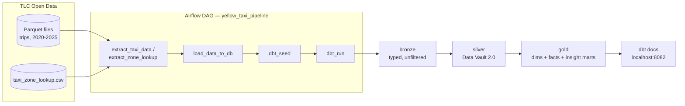
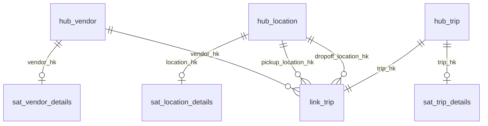

# NYC Yellow Taxi Data Pipeline

An end-to-end data engineering pipeline that ingests, loads, and transforms **NYC Yellow Taxi trip data from 2020–2025** into a **medallion architecture (bronze → silver → gold)** — with a full **Data Vault 2.0** model in the silver layer — using Apache Airflow, DuckDB, and dbt, all containerized with Docker.

---

## Table of Contents

- [Overview](#overview)
- [Architecture](#architecture)
- [Tech Stack](#tech-stack)
- [Data Models](#data-models)
  - [Bronze](#bronze--raw)
  - [Silver — Data Vault 2.0](#silver--data-vault-20)
  - [Gold](#gold--dimensional-marts)
- [Querying the Database](#querying-the-database)
- [Running the Full Pipeline](#running-the-full-pipeline)
  - [Prerequisites](#prerequisites)
  - [Setup](#setup)
  - [Trigger the DAG](#trigger-the-dag)
- [dbt Docs](#dbt-docs)
- [Project Structure](#project-structure)
- [Data Source](#data-source)
- [Notes & Limitations](#notes--limitations)

---

## Overview

This pipeline automates the full lifecycle of NYC Yellow Taxi data as a portfolio demonstration of the **medallion architecture** pattern, built on top of a proper **Data Vault 2.0** model rather than a single flat "clean" table:

1. **Extract** — downloads monthly trip Parquet files and the TLC taxi zone lookup CSV from the [NYC TLC website](https://www.nyc.gov/site/tlc/about/tlc-trip-record-data.page) for every month between January 2020 and December 2025
2. **Load** — ingests everything into a local DuckDB database as raw tables
3. **Transform (dbt)** —
   - **Bronze**: raw data renamed to snake_case and lightly typed, no filtering
   - **Silver**: a Data Vault 2.0 model — hubs, links, and hashdiff-gated satellites — built incrementally
   - **Gold**: dimensions and facts rebuilt from the vault, plus a set of business-facing insight marts

> **Note:** The raw Parquet files, zone lookup CSV, and DuckDB database are **not** included in the repository due to their size. You must [run the pipeline](#running-the-full-pipeline) first to download the data and populate the database before querying it.

---

## Architecture



The Airflow cluster runs on **CeleryExecutor** with Redis as the message broker and PostgreSQL as the metadata database. Every dbt layer materializes into its own DuckDB schema (`main_bronze`, `main_silver`, `main_gold`) so the medallion boundaries are visible in the database itself, not just in folder names.

---

## Tech Stack

| Tool | Version | Role |
|---|---|---|
| [Apache Airflow](https://airflow.apache.org/) | 2.11.2 | Pipeline orchestration |
| [DuckDB](https://duckdb.org/) | 1.2.2 | Embedded analytical database |
| [dbt-duckdb](https://github.com/duckdb/dbt-duckdb) | 1.9.2 | Data transformation |
| [Docker + Docker Compose](https://www.docker.com/) | — | Containerization |
| [Redis](https://redis.io/) | 7.2 | Celery message broker |
| [PostgreSQL](https://www.postgresql.org/) | 13 | Airflow metadata database |

---

## Data Models

### Bronze — raw

Materialized as **views**. Source columns renamed to snake_case with light type casting. No filtering, no deduplication — bronze is a faithful mirror of what was ingested.

| Model | Description |
|---|---|
| `bronze_yellow_taxi` | Raw trip records, one row per source record |
| `bronze_taxi_zone_lookup` | Raw TLC taxi zone lookup (LocationID → borough/zone/service zone) |

### Silver — Data Vault 2.0

The silver layer isn't a single "clean staging table" — it's a real [Data Vault 2.0](https://en.wikipedia.org/wiki/Data_vault_modeling) model: **hubs** hold business keys, **links** hold relationships between hubs, and **satellites** hold descriptive, historized attributes. All silver models are `incremental` and insert-only — re-running the pipeline only appends new keys or changed satellite rows, it never rewrites history.



| Model | Type | Description |
|---|---|---|
| `stg_dv_yellow_taxi` | prep view | Applies data-quality gates (`passenger_count > 0`, `trip_distance > 0`, pickup year ≥ 2020) and computes every hash key + hashdiff used below, in one place |
| `hub_vendor` | hub | One row per vendor (business key: `vendor_id`) |
| `hub_location` | hub | One row per TLC zone (business key: `location_id`), sourced from both the zone lookup and any pickup/dropoff IDs seen in trips |
| `hub_trip` | hub | One row per trip. Trips have **no natural ID** in the TLC source, so the business key is a composite hash of vendor + pickup/dropoff time + pickup/dropoff location + distance + fare |
| `link_trip` | link | Associates a trip with its vendor, pickup location, and dropoff location |
| `sat_vendor_details` | satellite | Vendor display name (from the `vendor_lookup` seed) |
| `sat_location_details` | satellite | Borough / zone / service zone |
| `sat_trip_details` | satellite | Trip times, fares, taxes, and surcharges — a new row is only written when the hashdiff of these attributes actually changes |

### Gold — dimensional marts

Materialized as **tables**, rebuilt from the vault.

| Model | Description |
|---|---|
| `dim_vendor`, `dim_location`, `dim_date` | Dimensions — location includes borough/zone names, date is a 2020–2026 calendar spine |
| `fct_trips` | Trip-grain fact: one row per trip, with derived `trip_duration_minutes` and `tip_pct` |
| `fct_daily_summary` | Trips and revenue aggregated to the day grain |
| `yellow_taxi_yearly_trips_amounts` | Year-over-year rollup of total trips and revenue |
| `yellow_taxi_2020_monthly_percentage_drops` | Month-over-month % drop in trips/revenue through 2020 (COVID impact) |
| `trips_by_payment_type` | Trip counts, revenue, and tipping behavior by payment type |
| `trips_by_borough` | Trip counts, revenue, and avg. distance by pickup borough × dropoff borough |
| `trips_by_hour_dow` | Ridership heatmap — trip counts, avg. fare, avg. tip % by day of week × hour of day |
| `vendor_performance` | Trip counts, revenue, avg. distance, avg. tip % by vendor |
| `trip_distance_buckets` | Trips bucketed by distance (short/medium/long/very long) with avg. fare, duration, tip % |

---

## Querying the Database

Once you have [run the pipeline](#running-the-full-pipeline), the DuckDB database will be available at `data/raw/database.duckdb`. Because each dbt layer has its own `+schema` config and the target schema in `profiles.yml` is unset (defaults to `main`), dbt materializes relations into `main_bronze`, `main_silver`, `main_gold`, and `main_seeds`.

### Option 1 — Python

```python
import duckdb

con = duckdb.connect("data/raw/database.duckdb")

# View all existing tables and views in the database
print(con.execute("SHOW ALL TABLES").df())

# Trip-grain fact
con.sql("SELECT * FROM main_gold.fct_trips LIMIT 10").show()

# Ridership heatmap
con.sql("SELECT * FROM main_gold.trips_by_hour_dow ORDER BY day_of_week, pickup_hour").show()

# 2020 COVID impact
con.sql("SELECT * FROM main_gold.yellow_taxi_2020_monthly_percentage_drops").show()

# Peek at the silver Data Vault directly
con.sql("SELECT * FROM main_silver.hub_trip LIMIT 5").show()
```

You can also run the included `test.py` script from the project root as a quick way to print all existing relations:

```bash
python test.py
```

### Option 2 — DuckDB CLI

```bash
duckdb data/raw/database.duckdb
```

```sql
-- Inside the DuckDB shell
SHOW TABLES;
SELECT * FROM main_gold.vendor_performance;
```

### Option 3 — Any DuckDB-compatible tool

Tools like [Harlequin](https://harlequin.sh/), [DBeaver](https://dbeaver.io/), or [Tableau](https://www.tableau.com/) can connect directly to a `.duckdb` file.

---

## Running the Full Pipeline

Follow the steps below to stand up the stack, trigger the pipeline, and populate the database.

### Prerequisites

- [Docker Desktop](https://www.docker.com/products/docker-desktop/) (with at least **4 GB RAM** and **2 CPUs** allocated)
- [Docker Compose](https://docs.docker.com/compose/) (included with Docker Desktop)
- ~**30 GB** of free disk space for the raw Parquet files (2020–2025)

### Setup

**1. Clone the repository**

```bash
git clone https://github.com/JacobBueno7/NYC-Taxi-Data-Pipeline.git
cd NYC-Taxi-Data-Pipeline
```

**2. Create a `.env` file** (Linux/macOS only — sets the Airflow user ID)

```bash
echo "AIRFLOW_UID=$(id -u)" > .env
```

On Windows, skip this step or create a `.env` file with:

```
AIRFLOW_UID=50000
```

**3. Build the custom Airflow image and start all services**

```bash
docker compose up --build -d
```

This starts:
- Airflow webserver → [http://localhost:8080](http://localhost:8080)
- Airflow scheduler, worker, and triggerer
- PostgreSQL (Airflow metadata)
- Redis (Celery broker)
- dbt Docs server → [http://localhost:8082](http://localhost:8082)

First startup can take **2–5 minutes** while services initialize.

**4. Verify all containers are healthy**

```bash
docker compose ps
```

All services should show `healthy` or `running`.

### Trigger the DAG

**1. Open the Airflow UI**

Navigate to [http://localhost:8080](http://localhost:8080) in your browser. Log in with the default credentials:
- **Username:** `airflow`
- **Password:** `airflow`

**2. Find the DAG**

On the **DAGs** page you'll see a list of all available DAGs. Look for `yellow_taxi_pipeline`. It will be paused by default (indicated by a grey toggle on the left side of the row).

**3. Unpause the DAG**

Click the **toggle** to the left of `yellow_taxi_pipeline` to turn it on. It will turn blue when active. Airflow won't schedule or run any DAG while it's paused.

**4. Trigger a manual run**

On the right side of the DAG row, click the **▶ (Trigger DAG)** button. In the dialog that appears, click **Trigger** to confirm. This queues an immediate run without waiting for the next scheduled interval.

**5. Monitor the run**

Click on the DAG name (`yellow_taxi_pipeline`) to open its detail page, then select the **Grid** tab. You'll see the run appear as a column with task boxes for each step:

```
extract_taxi_data ──┐
                     ├──► load_data_to_db ──► dbt_seed ──► dbt_run
extract_zone_lookup ─┘
```

Task box colors indicate status:

| Color | Status |
|---|---|
| 🟡 Yellow | Queued |
| 🟢 Light green | Running |
| ✅ Dark green | Success |
| 🔴 Red | Failed |

**6. View task logs**

If a task fails or you want to see progress, click the task box in the Grid view and select **Logs** from the popup panel. This shows the full stdout output for that task — useful for debugging download errors or dbt failures.

> **Note:** The `extract_taxi_data` task downloads 72 monthly Parquet files (2020–2025) and will take a while depending on your internet connection. Already-downloaded files (and the zone lookup CSV, once fetched) are skipped, so re-runs are safe.

> **Troubleshooting — 403 error during download:** Occasionally the NYC TLC server returns a 403 and does not let you download the file. If the `extract_taxi_data` task fails with a 403 error, run `docker compose down` and then re-trigger the pipeline. Already-downloaded files will be skipped, so only the missing ones will be retried.

**To stop all services:**

```bash
docker compose down
```

To also remove the PostgreSQL volume (clears Airflow metadata):

```bash
docker compose down -v
```

---

## dbt Docs

When running the full stack, a dbt documentation site is served at [http://localhost:8082](http://localhost:8082). It provides an interactive lineage graph across bronze → silver → gold and full model/column documentation.

To generate and serve dbt docs locally (outside Docker), run inside the `dbt/` directory:

```bash
cd dbt
dbt seed --profiles-dir .
dbt docs generate --profiles-dir .
dbt docs serve --profiles-dir . --port 8082
```

---

## Project Structure

```
NYC-Taxi-Data-Pipeline/
├── dags/
│   ├── data_extract.py            # Download + load functions (trips + zone lookup)
│   └── dbt_dag.py                 # Airflow DAG definition
├── dbt/
│   ├── models/
│   │   ├── bronze/
│   │   │   ├── bronze_yellow_taxi.sql
│   │   │   ├── bronze_taxi_zone_lookup.sql
│   │   │   └── schema.yml         # sources + bronze model docs
│   │   ├── silver/
│   │   │   ├── stg_dv_yellow_taxi.sql   # hash key / hashdiff prep
│   │   │   ├── hubs/
│   │   │   │   ├── hub_vendor.sql
│   │   │   │   ├── hub_location.sql
│   │   │   │   └── hub_trip.sql
│   │   │   ├── links/
│   │   │   │   └── link_trip.sql
│   │   │   ├── satellites/
│   │   │   │   ├── sat_vendor_details.sql
│   │   │   │   ├── sat_location_details.sql
│   │   │   │   └── sat_trip_details.sql
│   │   │   └── schema.yml         # DV model docs + relationship tests
│   │   └── gold/
│   │       ├── dim_vendor.sql
│   │       ├── dim_location.sql
│   │       ├── dim_date.sql
│   │       ├── fct_trips.sql
│   │       ├── fct_daily_summary.sql
│   │       ├── yellow_taxi_yearly_trips_amounts.sql
│   │       ├── yellow_taxi_2020_monthly_percentage_drops.sql
│   │       ├── trips_by_payment_type.sql
│   │       ├── trips_by_borough.sql
│   │       ├── trips_by_hour_dow.sql
│   │       ├── vendor_performance.sql
│   │       ├── trip_distance_buckets.sql
│   │       └── schema.yml
│   ├── seeds/
│   │   ├── vendor_lookup.csv      # static VendorID -> name reference data
│   │   └── schema.yml
│   ├── dbt_project.yml
│   └── profiles.yml
├── data/
│   └── raw/                       # Populated after running the pipeline
│       ├── database.duckdb
│       ├── taxi_zone_lookup.csv
│       └── yellow_tripdata_*.parquet
├── Dockerfile                     # Custom Airflow image with dbt + dependencies
├── docker-compose.yaml            # Full stack definition
└── requirements.txt                # Python dependencies
```

---

## Data Source

Raw data comes from the [NYC Taxi & Limousine Commission (TLC) Trip Record Data](https://www.nyc.gov/site/tlc/about/tlc-trip-record-data.page).

Trip files follow the naming pattern:
```
https://d37ci6vzurychx.cloudfront.net/trip-data/yellow_tripdata_{YEAR}-{MONTH}.parquet
```

The taxi zone lookup table is a single static file:
```
https://d37ci6vzurychx.cloudfront.net/misc/taxi_zone_lookup.csv
```

---

## Notes & Limitations

- This `docker-compose.yaml` is a **local development configuration** (per the upstream Airflow quickstart) — it is not hardened for production use.
- Raw data files and the DuckDB database are **not** checked into the repo; `.gitignore` excludes `data/raw/*.parquet`, `data/raw/*.csv`, and `data/raw/*.duckdb`.
- Each pipeline run re-reads **all** locally downloaded Parquet files (`CREATE OR REPLACE TABLE ... FROM read_parquet('data/raw/yellow_tripdata_*.parquet')`), so bronze always reflects full history. The silver hub/link/satellite models are what's actually incremental — they only insert business keys or attribute changes they haven't seen before.
- `hub_trip`'s business key is a composite hash (vendor + pickup/dropoff time + pickup/dropoff location + distance + fare) because the TLC source has no natural trip ID. Two trips identical across every one of those fields will collapse into a single hub row — an accepted, documented limitation of the source data rather than a bug in the vault.
- The `yellow_taxi_2020_monthly_percentage_drops` model has no prior-month comparison for January (there's no December 2019 in scope), so its `trip_drop_percent`/`revenue_drop_percent` for January will be `null`.

---

## Author

**Jacob Bueno** — [portfolio site](https://jacobbueno7.github.io) · [GitHub](https://github.com/JacobBueno7)
